> ## ⚠️ *Disclaimer!* ⚠️
> ### *If you're looking for some .Net/C# code (especially the way I code), the only public projects available are [TamarinDB](https://github.com/tadedav/TamarinDB), [TamarinDashboard](https://github.com/tadedav/TamarinDashboard) and [My First WPF Desktop App](#my-first-wpf-desktop-app). The reason is that .NET, for me, is more production-oriented, and I can't share much. ([TamarinDB](https://github.com/tadedav/TamarinDB) + [TamarinDashboard](https://github.com/tadedav/TamarinDashboard)) are the only public projects I'm currently working on (just a little), without any comments or polish because they were rushed.*

## About Me
I love backend development, especially with .NET and Luvit. I also enjoy exploring graphics engines and want to learn more about like C++ and Vulkan. AI and Virtual reality excites me too.

I mainly use a MacBook with VS Code but also work with Linux servers and AWS for cloud projects.
I currently have 2 PCs at home serving as local servers.

## Project Showcase
>### Here are some old projects I found while going through my files. Most of them are about graphics because showing server-side stuff is harder. The code is rough and not polished, but I thought they might be fun to share (some of them on Github).

---

### MMORPG
- **Server:** Multiple versions across .NET and in the past LuaJIT
- **Client:** Unity, Developer Client .NET + Raylib

	<figure style="text-align: center;">
		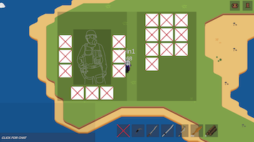
		<figcaption>Game1 Screenshot</figcaption>
	</figure>
	<figure style="text-align: center;">
		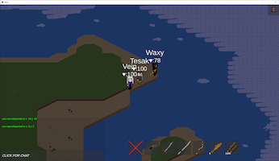
		<figcaption>Game2 Screenshot</figcaption>
	</figure>
	<figure style="text-align: center;">
		[Gameplay Video](Videos/combat.mp4)
	</figure>

	<figure style="text-align: center;">
		
		<figcaption>Developer Client</figcaption>
	</figure>

	<figure style="text-align: center;">
		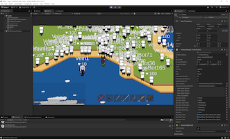
		<figcaption>Server Stress Test (~500 Clients)</figcaption>
	</figure>
	<figure style="text-align: center;">
		<video controls height="150"><source src="Videos/mmotest.mp4" type="video/mp4">Your browser does not support the video tag.</video>
		[Server Stress Test Video](Videos/mmotest.mp4)

	<figure style="text-align: center;">
		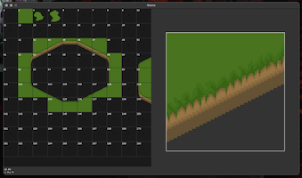
		<figcaption>Tile Editor</figcaption>
	</figure>
	<figure style="text-align: center;">
		<video controls height="150"><source src="Videos/test.mp4" type="video/mp4">Your browser does not support the video tag.</video>
		<figcaption>Travel Path Test</figcaption>
		[Travel Path Test](Videos/test.mp4)

---

### My own 2D engine with Box2D
<video controls height="150"><source src="Videos/engine1.mp4" type="video/mp4">Your browser does not support the video tag.</video>
<video controls height="150"><source src="Videos/engine2.mp4" type="video/mp4">Your browser does not support the video tag.</video>

[Engine Video 1](Videos/engine1.mp4)  
[Engine Video 2](Videos/engine2.mp4)
### GLSL Raytracing/Pathtracing [LINK](https://github.com/tadedav/lovr-rtx)
Created using GLSL, run using LÖVR

	<figure style="text-align: center;">
		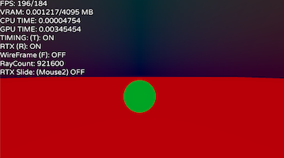
		<figcaption>RTX On</figcaption>
	</figure>
	<figure style="text-align: center;">
		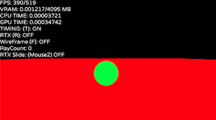
		<figcaption>RTX Off</figcaption>
	</figure>
	<figure style="text-align: center;">
		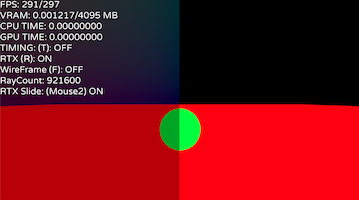
		<figcaption>RTX Half</figcaption>
	</figure>

---

### Cosmic Gliders
This was a game idea I gave up on because I started working on something cooler ([Online MMORPG](#MMORPG)). It was a multiplayer game with an authoritative server written in LuaJIT, client was made in Unity.

<video controls height="150"><source src="Videos/space.mp4" type="video/mp4">Your browser does not support the video tag.</video>
<video controls height="150"><source src="Videos/boat.mp4" type="video/mp4">Your browser does not support the video tag.</video>

[Space Video](Videos/space.mp4)  
[Boat Video](Videos/boat.mp4)
### Zombie Test
This project was unique as it was built without a game engine or framework. Features include buildings, sound zones, and line-of-sight mechanics.

<video controls height="150"><source src="Videos/zombie.mp4" type="video/mp4">Your browser does not support the video tag.</video>

---
[Zombie Video](Videos/zombie.mp4)
### random VR project
Created using LÖVR
- Hand Tracking: real-world length estimations using hand tracking.
- Air Drawing (TikTok): A **cringe** video of drawing in the air using a hand skeleton.

<video controls height="200"><source src="Videos/vr.mp4" type="video/mp4">Your browser does not support the video tag.</video>
<video controls height="200"><source src="Videos/tiktok.mp4" type="video/mp4">Your browser does not support the video tag.</video>

[VR Video](Videos/vr.mp4)  
[TikTok Video](Videos/tiktok.mp4)
### Raw Collisions + Catmull-Rom Splines
Created in both .NET and LuaJIT.

<video controls height="150"><source src="Videos/collisions.mp4" type="video/mp4">Your browser does not support the video tag.</video>
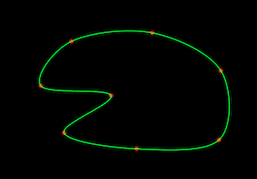
<video controls height="150"><source src="Videos/path.mp4" type="video/mp4">Your browser does not support the video tag.</video>

---

### My First WPF Desktop App
⚠️ **Warning:** This project was my first WPF application, created before 2019. At the time, I found it pretty exciting. It includes a login system, several small apps, and games I quickly put together to learn. The screenshots were taken on a Mac using Wine. *I have no idea where the source code is now.*
- Included a calculator
- Featured stopwatches
- Had a pseudo "cookie clicker" game called Coin Master
- Included a simple AI chasing game

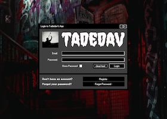
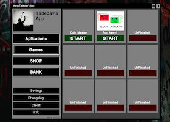
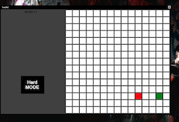

---

### Submarine Test (On my PC named oceangate :D)
Created using the Love2D Framework
- Played with an Xbox controller for a natural experience
- Endless map with procedural generation
- Stones form interconnected caves
- Deeper levels have more stones, increasing difficulty

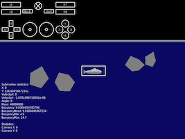
<video controls height="150"><source src="Videos/submarine.mp4" type="video/mp4">Your browser does not support the video tag.</video><video controls height="150"><source src="Videos/xbox.mov" type="video/mp4">Your browser does not support the video tag.</video>

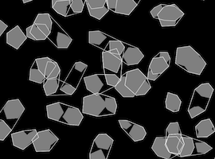
[Submarine Video](Videos/submarine.mp4)  
[Xbox Video](Videos/xbox.mov)
---

### Experimenting with Particles [LINK](https://github.com/tadedav/lovr2d-particle-test)
This isn't a full particle system, just a simple test project.
Created using the Love2D Framework

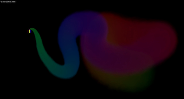
<video controls height="150"><source src="Videos/smoke.mp4" type="video/mp4">Your browser does not support the video tag.</video>
<video controls height="150"><source src="Videos/bum.mp4" type="video/mp4">Your browser does not support the video tag.</video>
[Smoke Video](Videos/smoke.mp4)  
[Bum Video](Videos/bum.mp4)

<video controls height="150"><source src="Videos/particles.mp4" type="video/mp4">Your browser does not support the video tag.</video>

[Particles Video](Videos/particles.mp4)
### Other Projects Not Listed Here
- For now, there's just one on my GitHub that I haven't included here.
- The rest of my projects are either private, not very interesting, or incomplete.

[Image Generator](https://github.com/tadedav/love2d-image-generator)

---